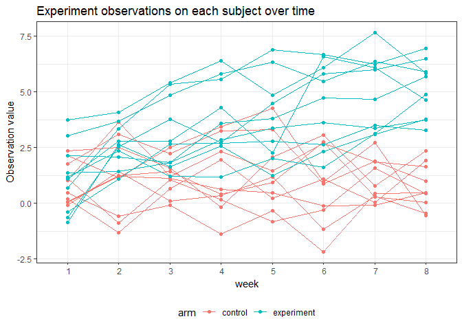

p8105\_hw5\_hh2767
================
Haoran Hu
2018-11-5

Problem 1
=========

Read in file names and files
----------------------------

In the following chunk, I will:

-   Start with a dataframe containing all file names, using list.file function

-   Use purrr::map to read in the data and save it as a new variable in the dataframe

``` r
exp_files = list.files(".\\data") %>% 
  strsplit(split = " ") %>% 
  tibble() %>% 
  rename(., file_name = .) %>% 
  mutate(data = map(.x = file_name, ~read_csv(str_c(".\\data\\", .x)))) 

head(exp_files)
```

    ## # A tibble: 6 x 2
    ##   file_name data            
    ##   <list>    <list>          
    ## 1 <chr [1]> <tibble [1 x 8]>
    ## 2 <chr [1]> <tibble [1 x 8]>
    ## 3 <chr [1]> <tibble [1 x 8]>
    ## 4 <chr [1]> <tibble [1 x 8]>
    ## 5 <chr [1]> <tibble [1 x 8]>
    ## 6 <chr [1]> <tibble [1 x 8]>

So far, I have created a dataframe called "files". It includes two columns:"file\_name" and "data". The "file\_name" column shows all the file names, and the "data" colume contains the data in each file corresponding to those file names.

Tidy the results
----------------

Next, I will:

-   Show arms and IDs of subjects in the dataframe.

-   Tidy the weekly observation data

-   Recode the data into informative forms. For example, changing "con" into "control".

``` r
exp_data = 
  exp_files %>% 
  separate(file_name, into = c("arm", "subject_id"), sep = "_") %>% 
  separate(subject_id, into = c("subject_id", "remove"), sep = "\\.") %>% 
  select(-remove) %>% 
  mutate(., arm = recode(.$arm, con = "control", exp = "experiment")) %>% 
  unnest() %>% 
  gather(key = week, value = value, week_1:week_8) %>% 
  mutate(week = str_replace(week, "week_", " "),  
         subject = str_c(arm, "_", subject_id)) %>% 
  select(subject, arm, week, value)

head(exp_data)
```

    ## # A tibble: 6 x 4
    ##   subject    arm     week  value
    ##   <chr>      <chr>   <chr> <dbl>
    ## 1 control_01 control " 1"   0.2 
    ## 2 control_02 control " 1"   1.13
    ## 3 control_03 control " 1"   1.77
    ## 4 control_04 control " 1"   1.04
    ## 5 control_05 control " 1"   0.47
    ## 6 control_06 control " 1"   2.37

``` r
exp_data %>% 
  ggplot(aes(x = week, y = value, group = subject, color = arm)) + 
  labs(title = "Experiment observations on each subject over time", y = "Observation value") + 
  geom_line() +
  geom_point() +
  theme_bw()  + theme(legend.position = "bottom")
```



From the spaghetti plot, we can see that the observation values of subjects in experimental arm is higher than that of subjects in control arm. In addition, the observation values of subjects in experimental arm kept increasing over time, while the observation values of subjects in control arm remain stable. In other words, the difference between observation value of subjects in experimental arm and that of subjects in control arm became greater over time.
