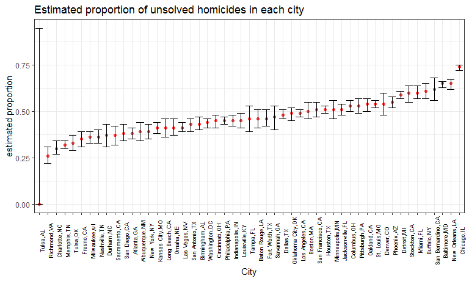

p8105\_hw5\_hh2767
================
Haoran Hu
2018-11-5

Problem 1
=========

Read in file names and files
----------------------------

In the following chunk, I will:

-   Start with a dataframe containing all file names, using list.file function

-   Use purrr::map to read in the data and save it as a new variable in the dataframe

``` r
exp_files = list.files(".\\data\\data_exp") %>% 
  strsplit(split = " ") %>% 
  tibble() %>% 
  rename(., file_name = .) %>% 
  mutate(data = purrr::map(.x = file_name, ~read_csv(str_c(".\\data\\data_exp\\", .x)))) 

head(exp_files)
## # A tibble: 6 x 2
##   file_name data            
##   <list>    <list>          
## 1 <chr [1]> <tibble [1 x 8]>
## 2 <chr [1]> <tibble [1 x 8]>
## 3 <chr [1]> <tibble [1 x 8]>
## 4 <chr [1]> <tibble [1 x 8]>
## 5 <chr [1]> <tibble [1 x 8]>
## 6 <chr [1]> <tibble [1 x 8]>
```

So far, I have created a dataframe called "files". It includes two columns:"file\_name" and "data". The "file\_name" column shows all the file names, and the "data" colume contains the data in each file corresponding to those file names.

Tidy the results
----------------

Next, I will:

-   Show arms and IDs of subjects in the dataframe.

-   Tidy the weekly observation data.

-   Recode the data into informative forms. For example, changing "con" into "control".

``` r
exp_data = 
  exp_files %>% 
  separate(file_name, into = c("arm", "subject_id"), sep = "_") %>% 
  separate(subject_id, into = c("subject_id", "remove"), sep = "\\.") %>% 
  select(-remove) %>% 
  mutate(., arm = recode(.$arm, con = "control", exp = "experiment")) %>% 
  unnest() %>% 
  gather(key = week, value = value, week_1:week_8) %>% 
  mutate(week = str_replace(week, "week_", " "),  
         subject = str_c(arm, "_", subject_id)) %>% 
  select(subject, arm, week, value)

str(exp_data)
## Classes 'tbl_df', 'tbl' and 'data.frame':    160 obs. of  4 variables:
##  $ subject: chr  "control_01" "control_02" "control_03" "control_04" ...
##  $ arm    : chr  "control" "control" "control" "control" ...
##  $ week   : chr  " 1" " 1" " 1" " 1" ...
##  $ value  : num  0.2 1.13 1.77 1.04 0.47 2.37 0.03 -0.08 0.08 2.14 ...
```

The finel dataset is a 160(rows) \* 4(cols) dataset. It contains four variables:

-   subject, which shows the ids of subjects.

-   arm, which shows whether a subject is in experimental arm or control arm

-   week, which shows the time of an observation

-   value, which shows observation value

This dataset is a tidy dataset.

Making a plot
-------------

``` r
exp_data %>% 
  ggplot(aes(x = week, y = value, group = subject, color = arm)) + 
  labs(title = "Experiment observations on each subject over time", y = "Observation value") + 
  geom_line() +
  geom_point() +
  theme_bw()  + theme(legend.position = "bottom")
```


From the spaghetti plot, we can see that the observation values of subjects in experimental arm is higher than that of subjects in control arm. In addition, the observation values of subjects in experimental arm kept increasing over time, while the observation values of subjects in control arm remain stable. In other words, the difference between observation value of subjects in experimental arm and that of subjects in control arm became greater over time.

Problem 2
=========

Read and describe the dataset
-----------------------------

``` r

homicide = GET("https://raw.githubusercontent.com/washingtonpost/data-homicides/master/homicide-data.csv") %>% 
  content("raw") %>% 
  read_csv
## Parsed with column specification:
## cols(
##   uid = col_character(),
##   reported_date = col_integer(),
##   victim_last = col_character(),
##   victim_first = col_character(),
##   victim_race = col_character(),
##   victim_age = col_character(),
##   victim_sex = col_character(),
##   city = col_character(),
##   state = col_character(),
##   lat = col_double(),
##   lon = col_double(),
##   disposition = col_character()
## )
str(homicide)
## Classes 'tbl_df', 'tbl' and 'data.frame':    52179 obs. of  12 variables:
##  $ uid          : chr  "Alb-000001" "Alb-000002" "Alb-000003" "Alb-000004" ...
##  $ reported_date: int  20100504 20100216 20100601 20100101 20100102 20100126 20100127 20100127 20100130 20100210 ...
##  $ victim_last  : chr  "GARCIA" "MONTOYA" "SATTERFIELD" "MENDIOLA" ...
##  $ victim_first : chr  "JUAN" "CAMERON" "VIVIANA" "CARLOS" ...
##  $ victim_race  : chr  "Hispanic" "Hispanic" "White" "Hispanic" ...
##  $ victim_age   : chr  "78" "17" "15" "32" ...
##  $ victim_sex   : chr  "Male" "Male" "Female" "Male" ...
##  $ city         : chr  "Albuquerque" "Albuquerque" "Albuquerque" "Albuquerque" ...
##  $ state        : chr  "NM" "NM" "NM" "NM" ...
##  $ lat          : num  35.1 35.1 35.1 35.1 35.1 ...
##  $ lon          : num  -107 -107 -107 -107 -107 ...
##  $ disposition  : chr  "Closed without arrest" "Closed by arrest" "Closed without arrest" "Closed by arrest" ...
##  - attr(*, "spec")=List of 2
##   ..$ cols   :List of 12
##   .. ..$ uid          : list()
##   .. .. ..- attr(*, "class")= chr  "collector_character" "collector"
##   .. ..$ reported_date: list()
##   .. .. ..- attr(*, "class")= chr  "collector_integer" "collector"
##   .. ..$ victim_last  : list()
##   .. .. ..- attr(*, "class")= chr  "collector_character" "collector"
##   .. ..$ victim_first : list()
##   .. .. ..- attr(*, "class")= chr  "collector_character" "collector"
##   .. ..$ victim_race  : list()
##   .. .. ..- attr(*, "class")= chr  "collector_character" "collector"
##   .. ..$ victim_age   : list()
##   .. .. ..- attr(*, "class")= chr  "collector_character" "collector"
##   .. ..$ victim_sex   : list()
##   .. .. ..- attr(*, "class")= chr  "collector_character" "collector"
##   .. ..$ city         : list()
##   .. .. ..- attr(*, "class")= chr  "collector_character" "collector"
##   .. ..$ state        : list()
##   .. .. ..- attr(*, "class")= chr  "collector_character" "collector"
##   .. ..$ lat          : list()
##   .. .. ..- attr(*, "class")= chr  "collector_double" "collector"
##   .. ..$ lon          : list()
##   .. .. ..- attr(*, "class")= chr  "collector_double" "collector"
##   .. ..$ disposition  : list()
##   .. .. ..- attr(*, "class")= chr  "collector_character" "collector"
##   ..$ default: list()
##   .. ..- attr(*, "class")= chr  "collector_guess" "collector"
##   ..- attr(*, "class")= chr "col_spec"
```

The raw dataset contains 12 variables and 52179 observations. It contains information about 52179 homicides occured in the US. The variables in this dataset are:

-   uid: homicide id
-   reported\_date: reported date
-   victim\_last: last name of victim
-   victim\_first: first name of victim
-   victim\_race: race of victim
-   victim\_age: age of victim
-   victim\_sex: sex of victim
-   city: city of the homicides
-   state: state of the homicides
-   lat: occurrence latitude
-   lon: occurence longitude
-   disposition: result of investigation

The location, time, and information of victims of each homicide are included in the dataset. The dataset also indicates whether the homicides are solved or not.

Adding variables and tidying the dataset
----------------------------------------

In the following part, I will: \* create a sity\_state variable which show the city and state of occurence \* summarize within cities to obtain the total number of homicides and the number of unsolved homicides

``` r
homicide = homicide %>% 
  mutate(city_state = str_c(city, ",", state))

homicide_summary = homicide %>% 
  group_by(city_state) %>% 
  summarize(
    num_unsolved = sum(disposition %in% c("Open/No arrest", "Closed without arrest")),
         num_total = n()
    )
  
str(homicide_summary)
## Classes 'tbl_df', 'tbl' and 'data.frame':    51 obs. of  3 variables:
##  $ city_state  : chr  "Albuquerque,NM" "Atlanta,GA" "Baltimore,MD" "Baton Rouge,LA" ...
##  $ num_unsolved: int  146 373 1825 196 347 310 319 206 4073 309 ...
##  $ num_total   : int  378 973 2827 424 800 614 521 687 5535 694 ...
```

Use prop.test for Baltimore
---------------------------

In the following chunk, I will: \* apply prop.test to estimate the proportion of unsolved homicide in Baltimore. \* apply broom::tidy, and pull the estimated proportion and confidence intervals from the resulting dataframe.

``` r
 baltimore_homicide = homicide_summary %>% 
  filter(city_state == "Baltimore,MD")
  
baltimore_test = prop.test(baltimore_homicide$num_unsolved, baltimore_homicide$num_total) %>% 
  broom::tidy() 


tibble(
  city = "Baltimore,MD",
  'estimated proportion' = pull(baltimore_test, estimate),
  'confidence interval' = str_c("[",round(pull(baltimore_test, conf.low), 2),", ", round(pull(baltimore_test, conf.high), 2), "]")
) %>% 
  knitr::kable(digits = 2)
```

| city         |  estimated proportion| confidence interval |
|:-------------|---------------------:|:--------------------|
| Baltimore,MD |                  0.65| \[0.63, 0.66\]      |

Apply the process above to each of the cities
---------------------------------------------

In this part, I will make use of purrr::map, purrr::map2, list columns and unnest to apply the process shown in the last part to each of the cities.

``` r
city_homicide = function(unsolve, total){
  city_test = prop.test(unsolve, total) %>% 
    broom::tidy()
  tibble(
  'estimated proportion' = round(pull(city_test, estimate), 2),
  CI_low = round(pull(city_test, conf.low), 2), 
  CI_high = round(pull(city_test, conf.high), 2)
)
}

homicide_summary = homicide_summary %>% 
  mutate(homicide_estimate = purrr::map2(num_unsolved, num_total, city_homicide)) %>% 
  unnest()
## Warning in prop.test(unsolve, total): Chi-squared approximation may be
## incorrect

unnest(homicide_summary)
## # A tibble: 51 x 6
##    city_state    num_unsolved num_total `estimated proport~ CI_low CI_high
##    <chr>                <int>     <int>               <dbl>  <dbl>   <dbl>
##  1 Albuquerque,~          146       378                0.39  0.34     0.44
##  2 Atlanta,GA             373       973                0.38  0.35     0.41
##  3 Baltimore,MD          1825      2827                0.65  0.63     0.66
##  4 Baton Rouge,~          196       424                0.46  0.41     0.51
##  5 Birmingham,AL          347       800                0.43  0.4      0.47
##  6 Boston,MA              310       614                0.5   0.46     0.55
##  7 Buffalo,NY             319       521                0.61  0.570    0.65
##  8 Charlotte,NC           206       687                0.3   0.27     0.34
##  9 Chicago,IL            4073      5535                0.74  0.72     0.75
## 10 Cincinnati,OH          309       694                0.45  0.41     0.48
## # ... with 41 more rows
```

Alternatively, if use purrr::map, we can get the same dataset, as shown below.

``` r
# city_homicide = function(data, city){
#   city_data = data %>%
#     filter(city_state == city)
#   
#   city_test = prop.test(city_data$num_unsolved, city_data$num_total) %>% 
#     broom::tidy()
#   
#   tibble(
#   'estimated proportion' = round(pull(city_test, estimate), 2),
#   CI_low = round(pull(city_test, conf.low), 2), 
#   CI_high = round(pull(city_test, conf.high), 2)
# )
# }
# 
# homicide_summary = homicide_summary %>% 
# mutate(homicide_estimate = map(.x = homicide_summary$city_state, ~city_homicide(data = homicide_summary, city = .x))) %>% 
#   unnest()
# 
# str(homicide_summary)
```

``` r
homicide_summary %>% 
  mutate(prop_unsolve = num_unsolved / num_total) %>% 
  arrange(prop_unsolve) %>% 
  #mutate(city_state = factor(city_state, levels = city_state)) %>% 
  mutate(city_state = forcats::fct_reorder(city_state, prop_unsolve)) %>% 
  ggplot(.) +
  geom_point(aes(x = city_state, y = `estimated proportion`), color = "brown1") +
  geom_errorbar( aes(x = city_state, ymin = CI_low, ymax = CI_high)) +
  labs(title = "Estimated proportion of unsolved homicides in each city", x = "City") +
  theme(axis.text.x = element_text(face = "plain", color = "black", size = 6.5, angle = 90), legend.position = "null")
```


